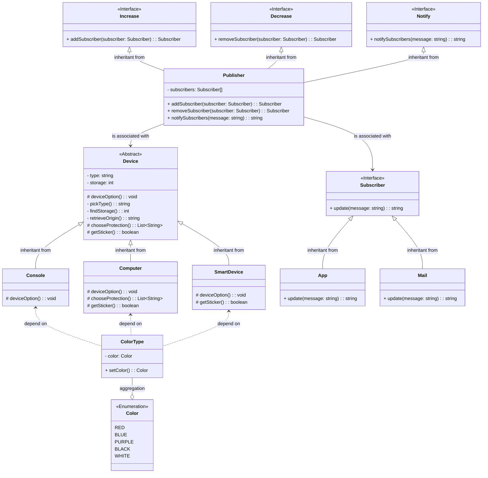

```mermaid
classDiagram
    class Device {
        <<Abstract>>
        - type: string
        - storage: int
        # deviceOption(): void
        - pickType(): string
        - findStorage(): int
        - retrieveOrigin(): string
        # chooseProtection(): List~String~
        # getSticker(): boolean
    }

    class Console {
        # deviceOption(): void
    }

    class Computer {
        # deviceOption(): void
        # chooseProtection(): List~String~
        # getSticker(): boolean
    }

    class SmartDevice {
        # deviceOption(): void
        # getSticker(): boolean
    }

    class Color {
        <<Enumeration>>
        RED
        BLUE
        PURPLE
        BLACK
        WHITE
    }

    class ColorType {
        - color: Color
        + setColor(): Color
    }

    class Increase {
        <<Interface>>
        + addSubscriber(subscriber: Subscriber): Subscriber
    }

    class Decrease {
        <<Interface>>
        + removeSubscriber(subscriber: Subscriber): Subscriber
    }

    class Notify {
        <<Interface>>
        + notifySubscribers(message: string): string
    }

    class Publisher {
        - subscribers: Subscriber[]
        + addSubscriber(subscriber: Subscriber): Subscriber
        + removeSubscriber(subscriber: Subscriber): Subscriber
        + notifySubscribers(message: string): string
    }

    class Subscriber {
        <<Interface>>
        + update(message: string): string
    }

    class App {
        + update(message: string): string
    }

    class Mail {
        + update(message: string): string
    }

    Device <|-- Console : inheritant from
    Device <|-- Computer : inheritant from
    Device <|-- SmartDevice : inheritant from
    Console <.. ColorType : depend on
    Computer <.. ColorType : depend on
    SmartDevice <.. ColorType : depend on
    ColorType --o Color : aggregation
    Increase <|-- Publisher : inheritant from
    Decrease <|-- Publisher : inheritant from
    Notify <|-- Publisher : inheritant from
    Publisher --> Device : is associated with
    Publisher --> Subscriber : is associated with
    Subscriber <|-- App : inheritant from
    Subscriber <|-- Mail : inheritant from
```