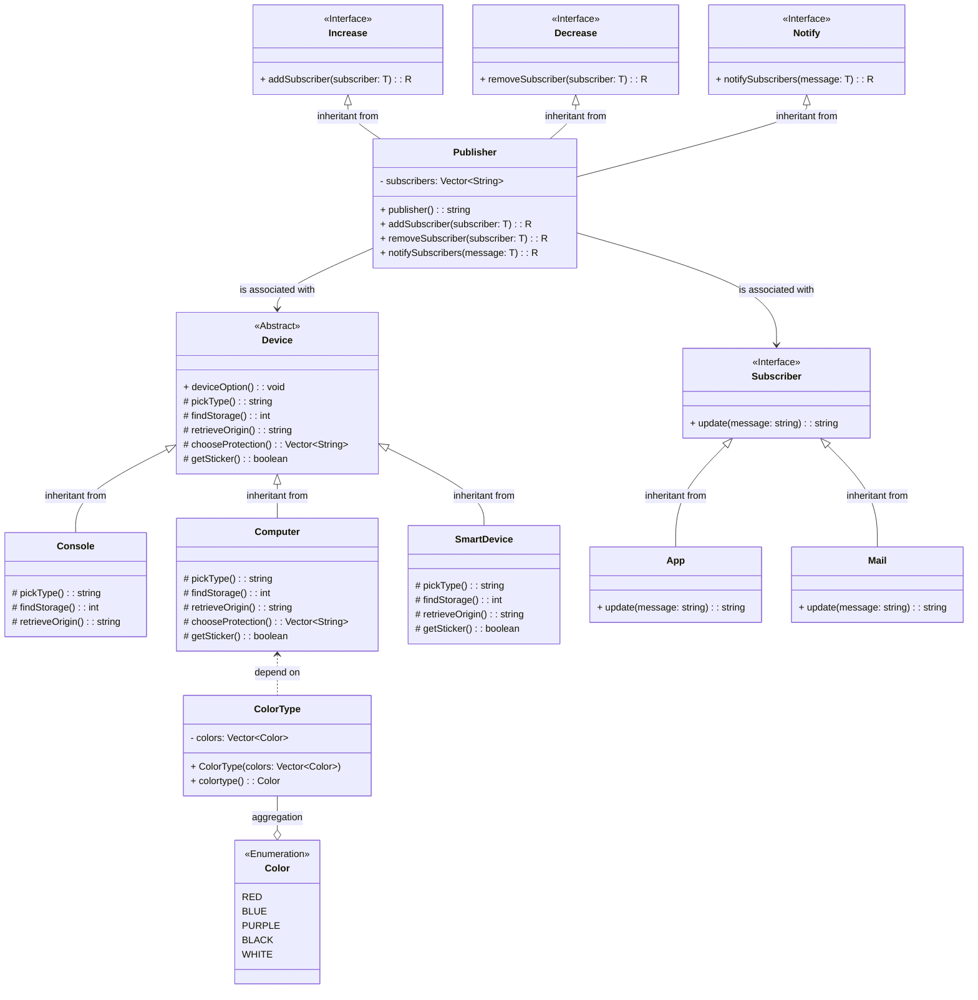

```mermaid
classDiagram
    class Device {
        <<Abstract>>
        + deviceOption(): void
        # pickType(): string
        # findStorage(): int
        # retrieveOrigin(): string
        # chooseProtection(): Vector~String~
        # getSticker(): boolean
    }

    class Console {
        # pickType(): string
        # findStorage(): int
        # retrieveOrigin(): string
    }

    class Computer {
        # pickType(): string
        # findStorage(): int
        # retrieveOrigin(): string
        # chooseProtection(): Vector~String~
        # getSticker(): boolean
    }

    class SmartDevice {
        # pickType(): string
        # findStorage(): int
        # retrieveOrigin(): string
        # getSticker(): boolean
    }

    class Color {
        <<Enumeration>>
        RED
        BLUE
        PURPLE
        BLACK
        WHITE
    }

    class ColorType {
        - colors: Vector~Color~
        + ColorType(colors: Vector~Color~)
        + colortype(): Color
    }

    class Increase {
        <<Interface>>
        + addSubscriber(subscriber: T): R
    }

    class Decrease {
        <<Interface>>
        + removeSubscriber(subscriber: T): R
    }

    class Notify {
        <<Interface>>
        + notifySubscribers(message: T): R
    }

    class Publisher {
        - subscribers: Vector~String~
        + publisher(): string
        + addSubscriber(subscriber: T): R
        + removeSubscriber(subscriber: T): R
        + notifySubscribers(message: T): R
    }

    class Subscriber {
        <<Interface>>
        + update(message: string): string
    }

    class App {
        + update(message: string): string
    }

    class Mail {
        + update(message: string): string
    }

    Device <|-- Console : inheritant from
    Device <|-- Computer : inheritant from
    Device <|-- SmartDevice : inheritant from
    Computer <.. ColorType : depend on
    ColorType --o Color : aggregation
    Increase <|-- Publisher : inheritant from
    Decrease <|-- Publisher : inheritant from
    Notify <|-- Publisher : inheritant from
    Publisher --> Device : is associated with
    Publisher --> Subscriber : is associated with
    Subscriber <|-- App : inheritant from
    Subscriber <|-- Mail : inheritant from
```