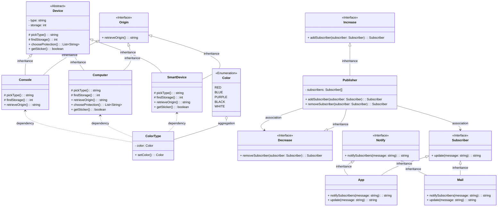

```mermaid
classDiagram
    class Device {
        <<Abstract>>
        - type: string
        - storage: int
        # pickType(): string
        # findStorage(): int
        + chooseProtection(): List~String~
        + getSticker(): boolean
    }

    class Origin {
        <<Interface>>
        + retrieveOrigin(): string
    }

    class Console {
        # pickType(): string
        # findStorage(): int
        + retrieveOrigin(): string
    }

    class Computer {
        # pickType(): string
        # findStorage(): int
        + retrieveOrigin(): string
        + chooseProtection(): List~String~
        + getSticker(): boolean
    }

    class SmartDevice {
        # pickType(): string
        # findStorage(): int
        + retrieveOrigin(): string
        + getSticker(): boolean
    }

    class Color {
        <<Enumeration>>
        RED
        BLUE
        PURPLE
        BLACK
        WHITE
    }

    class ColorType {
        - color: Color
        + setColor(): Color
    }

    class Increase {
        <<Interface>>
        + addSubscriber(subscriber: Subscriber): Subscriber
    }

    class Decrease {
        <<Interface>>
        + removeSubscriber(subscriber: Subscriber): Subscriber
    }

    class Notify {
        <<Interface>>
        + notifySubscribers(message: string): string
    }

    class Publisher {
        - subscribers: Subscriber[]
        + addSubscriber(subscriber: Subscriber): Subscriber
        + removeSubscriber(subscriber: Subscriber): Subscriber
    }

    class Subscriber {
        <<Interface>>
        + update(message: string): string
    }

    class App {
        + notifySubscribers(message: string): string
        + update(message: string): string
    }

    class Mail {
        + notifySubscribers(message: string): string
        + update(message: string): string
    }

    Device <|-- Console : inheritance
    Device <|-- Computer : inheritance
    Device <|-- SmartDevice : inheritance
    Origin <|-- Console : inheritance
    Origin <|-- Computer : inheritance
    Origin <|-- SmartDevice : inheritance
    Console <.. ColorType : dependency
    Computer <.. ColorType : dependency
    SmartDevice <.. ColorType : dependency
    Color o-- ColorType : aggregation
    Increase <|-- Publisher : inheritance
    Decrease <|-- Publisher : inheritance
    Publisher --> Decrease : association
    Publisher --> Subscriber : association
    Notify <|-- App : inheritance
    Notify <|-- Mail : inheritance
    Subscriber <|-- App : inheritance
    Subscriber <|-- Mail : inheritance
```