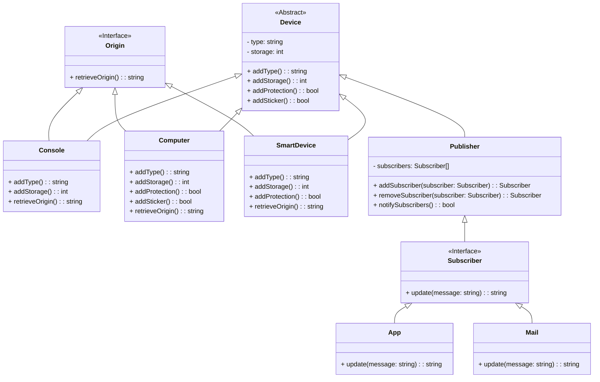

```mermaid
classDiagram
    class Device {
        <<Abstract>>
        - type: string
        - storage: int
        + addType(): string
        + addStorage(): int
        + addProtection(): bool
        + addSticker(): bool
    }

    class Console {
        + addType(): string
        + addStorage(): int
        + retrieveOrigin(): string
    }

    class Computer {
        + addType(): string
        + addStorage(): int
        + addProtection(): bool
        + addSticker(): bool
        + retrieveOrigin(): string
    }

    class SmartDevice {
        + addType(): string
        + addStorage(): int
        + addProtection(): bool
        + retrieveOrigin(): string
    }

    class Origin {
        <<Interface>>
        + retrieveOrigin(): string
    }

    class Publisher {
        - subscribers: Subscriber[]
        + addSubscriber(subscriber: Subscriber): Subscriber
        + removeSubscriber(subscriber: Subscriber): Subscriber
        + notifySubscribers(): bool
    }

    class Subscriber {
        <<Interface>>
        + update(message: string): string
    }

    class App {
        + update(message: string): string
    }

    class Mail {
        + update(message: string): string
    }

    Device <|-- Console
    Device <|-- Computer
    Device <|-- SmartDevice
    Publisher <|-- Subscriber
    Device <|-- Publisher
    Subscriber <|-- App
    Subscriber <|-- Mail
    Origin <|-- Console
    Origin <|-- Computer
    Origin <|-- SmartDevice
```